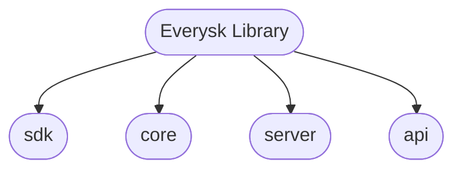

# Everysk Library SDK/API Skill

## When to Use This Skill

Use this skill when you need to:
- Work with Everysk Library (everysk-lib) SDK and API
- Understand the module structure (SDK, Core, API, Server)
- Create or interact with Everysk entities (portfolios, datastores, reports, files)
- Build workflows and automation with Everysk
- Use engines, utilities, and endpoints
- Perform calculations and data transformations
- Integrate with Everysk platform services

## Module Structure

The Everysk Library is organized into four main modules:



### 1. SDK Module (`everysk.sdk`)

**Purpose:** High-level interfaces for working with Everysk entities

**Sub-modules:**
- `everysk.sdk.entities` - Entity classes (Datastore, Portfolio, Report, File, Email, etc.)
- `everysk.sdk.engines` - Processing engines
- `everysk.sdk.brutils` - Brazilian utilities (CPF, CNPJ validation, etc.)

**Common Imports:**
```python
from everysk.sdk.entities import Datastore, Portfolio, Report, File, Email
from everysk.sdk.worker_base import WorkerBase
```

**Key Entity Operations:**
```python
# Datastore operations
datastore = Datastore.script.get(datastore_id)
datastore = Datastore.script.storage(storage_settings=settings, dataframe=df)

# Portfolio operations
portfolio = Portfolio.script.get(portfolio_id)

# Email operations
email = Email.script.get(email_id)
```

---

### 2. Core Module (`everysk.core`)

**Purpose:** Core utilities, serialization, and base classes

**Sub-modules:**
- `everysk.core.object` - Base objects (`BaseDict`, `BaseObject`)
- `everysk.core.serialize` - JSON/ORJSON serialization
- `everysk.core.datetime` - Date/time utilities
- `everysk.core.cloud_function` - Cloud function helpers
- `everysk.core.fixtures` - Test fixtures and utilities

**Common Imports:**
```python
from everysk.core.object import BaseDict, BaseObject
from everysk.core.serialize import dumps, loads
from everysk.core.datetime import format_datetime, parse_datetime
```

**BaseDict vs dict:**
```python
# ✅ CORRECT - Use BaseDict for Everysk types
storage_settings: BaseDict = None

# ❌ INCORRECT - Don't use dict
storage_settings: dict = None  # Type mismatch
```

**Serialization Examples:**
```python
# JSON serialization with special value handling
dumps(float('inf'), allow_nan=True)  # Returns 'Infinity'
dumps(float('-inf'), allow_nan=True)  # Returns '-Infinity'
dumps(float('nan'), allow_nan=True)  # Returns 'NaN'

# Load with class reconstruction
obj = loads('{"__class_path__":"everysk.core.object.BaseObject","a":1,"b":2}')
```

---

### 3. API Module (`everysk.api`)

**Purpose:** API client and resource interfaces

**Sub-modules:**
- `everysk.api.api_resources` - Resource classes for API interaction

**Common Patterns:**
```python
# API resource access pattern
resource = SomeResource.script.get(resource_id)
resource = SomeResource.script.create(**params)
```

---

### 4. Server Module (`everysk.server`)

**Purpose:** Server-side utilities and helpers

**Used for:** Server-side operations, backend processing

---

## Key Patterns & Best Practices

### Pattern 1: State Attribute Declaration

**For Worker/Entity Classes:**
```python
class MyWorkerOrEntity(WorkerBase):
    # Input attributes (from config)
    input_text: str
    mode: str = "default"

    # State attributes - ALWAYS use this pattern
    storage_settings: BaseDict = None
    _datastore: Datastore = None
    _entity: SomeEntity = None

    # Output attributes
    result: str = None
    success: bool = False
```

**Key Rules:**
1. Use class-level type annotations
2. Initialize with `= None` (not `| None = None`)
3. Use `BaseDict` for storage_settings (not dict)
4. Prefix internal state with underscore
5. Never initialize as instance attributes in methods

---

### Pattern 2: Datastore Operations

**Creating a Datastore:**
```python
import pandas as pd
from everysk.sdk.entities import Datastore
from everysk.core.object import BaseDict

# Prepare data
df = pd.DataFrame({
    'column1': [1, 2, 3],
    'column2': ['a', 'b', 'c']
})

# Storage settings
storage_settings = BaseDict({
    'storage_type': 'cloud',
    'workspace': 'main'
})

# Create datastore
datastore = Datastore.script.storage(
    storage_settings=storage_settings,
    dataframe=df,
    entity_name='my_datastore'
)

print(f"Created datastore: {datastore.id}")
```

**Retrieving a Datastore:**
```python
# Get existing datastore
datastore = Datastore.script.get(datastore_id='abc-123')

# Access dataframe
df = datastore.to_dataframe()
```

---

### Pattern 3: Serialization (JSON/ORJSON)

**Using Everysk Serialization:**
```python
from everysk.core.serialize import dumps, loads

# Serialize with NaN/Infinity handling
data = {
    'value': float('inf'),
    'score': float('nan')
}
json_str = dumps(data, allow_nan=True)

# Deserialize with class reconstruction
obj = loads(json_str, protocol='orjson')  # or 'json'
```

**Custom Serialization Method:**
```python
from everysk import settings

# Default method name: 'to_native'
settings.SERIALIZE_CONVERT_METHOD_NAME = 'to_native'

class MyObject:
    def to_native(self):
        return {'key': 'value'}

# Serializes using to_native()
dumps(MyObject())
```

---

### Pattern 4: Brazilian Utilities (brutils)

**CPF/CNPJ Validation:**
```python
from everysk.sdk.brutils import is_valid_cpf, is_valid_cnpj, format_cpf, format_cnpj

# CPF validation
if is_valid_cpf('123.456.789-10'):
    formatted = format_cpf('12345678910')  # Returns '123.456.789-10'

# CNPJ validation
if is_valid_cnpj('12.345.678/0001-95'):
    formatted = format_cnpj('12345678000195')  # Returns '12.345.678/0001-95'
```

---

## Installation & Setup

### Installation

```bash
# Install from PyPI
pip install everysk-lib

# Verify installation
python3 -c "import everysk"
```

### Importing

```python
# SDK entities
from everysk.sdk.entities import Datastore, Portfolio, Report, File, Email

# Core utilities
from everysk.core.object import BaseDict, BaseObject
from everysk.core.serialize import dumps, loads

# API resources
from everysk.api import SomeResource

# Brazilian utilities
from everysk.sdk.brutils import is_valid_cpf
```

---

## Testing

### Running Tests in Development

```bash
# Run all tests
./run.sh tests

# Run with coverage
./run.sh coverage
```

### Running Tests After Installation

```bash
# Run core tests
python3 -m unittest everysk.core.tests
```

---

## Common Use Cases

### Use Case 1: Building a Worker with Datastore Output

```python
from everysk.sdk.worker_base import WorkerBase
from everysk.sdk.entities import Datastore
from everysk.core.object import BaseDict
import pandas as pd

class DataProcessor(WorkerBase):
    """Process data and output to datastore"""

    # Inputs
    source_data: str
    entity_name: str = "processed_data"

    # State
    storage_settings: BaseDict = None
    _datastore: Datastore = None

    # Outputs
    datastore_id: str = None
    success: bool = False

    def handle_inputs(self) -> None:
        super().handle_inputs()
        # Initialize storage settings from config
        self.storage_settings = BaseDict(self.config.get('storage', {}))

    def handle_tasks(self) -> None:
        # Process data
        df = pd.DataFrame({'result': [self.source_data]})

        # Create datastore
        self._datastore = Datastore.script.storage(
            storage_settings=self.storage_settings,
            dataframe=df,
            entity_name=self.entity_name
        )

        self.datastore_id = self._datastore.id
        self.success = True

    def handle_outputs(self) -> None:
        super().handle_outputs()
        print(f"Datastore created: {self.datastore_id}")
```

---

### Use Case 2: Serializing Complex Objects

```python
from everysk.core.serialize import dumps, loads
from everysk.core.object import BaseObject

class Config(BaseObject):
    name: str
    value: float

    def to_native(self):
        return {
            'name': self.name,
            'value': self.value
        }

# Create object
config = Config(name='threshold', value=float('inf'))

# Serialize with NaN/Infinity support
json_str = dumps(config, allow_nan=True)

# Deserialize
restored = loads(json_str, protocol='orjson')
```

---

### Use Case 3: Working with Brazilian Documents

```python
from everysk.sdk.brutils import is_valid_cpf, format_cpf

def validate_and_format_cpf(cpf: str) -> str | None:
    """Validate and format CPF"""
    # Remove formatting
    cpf_digits = ''.join(filter(str.isdigit, cpf))

    # Validate
    if not is_valid_cpf(cpf_digits):
        return None

    # Format
    return format_cpf(cpf_digits)

# Usage
formatted = validate_and_format_cpf('12345678910')
if formatted:
    print(f"Valid CPF: {formatted}")  # 123.456.789-10
```

---

## Troubleshooting

### Issue: FieldValueError on State Attributes

**Problem:**
```python
storage_settings: dict | BaseDict | None = None  # ❌ FAILS
```

**Solution:**
```python
storage_settings: BaseDict = None  # ✅ WORKS
```

---

### Issue: ModuleNotFoundError for everysk

**Problem:** Can't import everysk modules

**Solution:**
```bash
# Reinstall
pip install --upgrade everysk-lib

# Verify
python3 -c "import everysk; print(everysk.__version__)"
```

---

### Issue: Serialization Fails with NaN/Infinity

**Problem:** JSON encoder fails with special float values

**Solution:**
```python
# Use allow_nan=True
from everysk.core.serialize import dumps
json_str = dumps(data, allow_nan=True)
```

---

## Architecture Overview

```
everysk-lib/
├── src/everysk/
│   ├── api/              # API client & resources
│   │   └── api_resources/
│   ├── core/             # Core utilities
│   │   ├── object.py     # BaseDict, BaseObject
│   │   ├── serialize/    # JSON/ORJSON
│   │   ├── datetime/     # Date utilities
│   │   └── cloud_function/
│   ├── sdk/              # High-level SDK
│   │   ├── entities/     # Datastore, Portfolio, etc.
│   │   ├── engines/      # Processing engines
│   │   ├── brutils/      # Brazilian utilities
│   │   └── worker_base.py
│   ├── server/           # Server utilities
│   └── sql/              # SQL utilities
├── docs/                 # Documentation
├── tests/                # Test suite
└── pyproject.toml        # Project config
```

---

## Quick Reference

| Module | Purpose | Key Classes |
|--------|---------|-------------|
| `everysk.sdk.entities` | Entity operations | Datastore, Portfolio, Report, File |
| `everysk.core.object` | Base classes | BaseDict, BaseObject |
| `everysk.core.serialize` | Serialization | dumps, loads |
| `everysk.sdk.worker_base` | Worker base class | WorkerBase |
| `everysk.sdk.brutils` | Brazilian utilities | is_valid_cpf, format_cpf |

---

## Resources

- **GitHub:** [https://github.com/Everysk/everysk-lib](https://github.com/Everysk/everysk-lib)
- **PyPI:** [https://pypi.org/project/everysk-lib/](https://pypi.org/project/everysk-lib/)
- **Documentation:** See `docs/` directory in repository
- **License:** Proprietary - © 2025 EVERYSK TECHNOLOGIES

---

## Related Skills

- `workers-everysk` - Building Everysk workers
- `everysk-mcp` - MCP server implementations
- `everysk-backend` - Backend development with Serena project

---

**Remember:**
1. **Always use `BaseDict` for storage_settings** - Not dict
2. **State attributes: `Type = None`** - Not `Type | None = None`
3. **Use entity.script methods** - `.script.get()`, `.script.storage()`
4. **Import from correct modules** - `everysk.sdk.entities`, `everysk.core.object`
5. **Handle NaN/Infinity** - Use `allow_nan=True` in serialization
